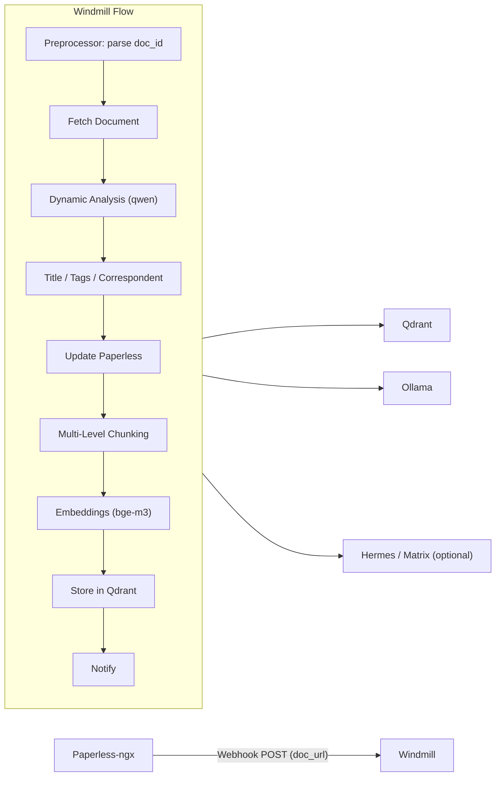

# pAIperless

AI-Erweiterung für [Paperless-ngx](https://github.com/paperless-ngx/paperless-ngx): automatische Metadaten-Generierung, semantisches Chunking und Vektor-Speicherung in Qdrant — orchestriert mit [Windmill](https://www.windmill.dev/).

## Architektur



## Features

- **Trigger**: Paperless-ngx Webhook bei neuem Dokument
- **Metadaten**: Titel, Tags und Korrespondent via Ollama/qwen
- **Dynamische Analyse**: keine festen Dokumenttypen — das Modell beschreibt Struktur und Wichtigkeit frei
- **Semantische Chunk-Gewichtung**: High (Header, Summary, Totals), Normal (Fließtext), Low (Boilerplate)
- **Embeddings**: Ollama/bge-m3 (1024 Dimensionen) in Qdrant
- **Warnings**: bei neu angelegten Tags/Korrespondenten (Logging, Matrix oder Hermes)
- **Search UI**: semantische Suche über alle Dokumente mit Filterung und Dokument-Gruppierung (FastAPI + HTMX)

## Voraussetzungen

- Docker & Docker Compose
- Paperless-ngx (läuft bereits)
- Ollama mit Modellen `qwen3` (oder konfiguriertes LLM) und `bge-m3`
- Optional: Hermes Agent oder Matrix für Benachrichtigungen

## Setup

### 1. Umgebung konfigurieren

```bash
cp .env.example .env
# .env anpassen: PAPERLESS_API_TOKEN, OLLAMA_URL, etc.
```

### 2. Stack starten

```bash
docker compose up -d
```

Startet Qdrant, Windmill (Server + Worker), PostgreSQL und die Search UI.

### 3. Windmill einrichten

1. UI öffnen: `http://localhost:8000`
2. Workspace anlegen (z. B. `main`)
3. API-Token erstellen
4. Scripts und Flow deployen:

```bash
npm install -g windmill-cli   # oder: curl -fsSL https://windmill.dev/install.sh | bash
wmill login
wmill sync push
```

### 4. Paperless-ngx Workflow

In Paperless unter **Settings → Workflows**:

| Feld | Wert |
|------|------|
| Name | pAIperless Auto-Process |
| Trigger | Document Added |
| Action | Webhook |
| URL | `http://<windmill-host>:8000/api/w/<workspace>/jobs/run/f/paiperless/process_document?token=<TOKEN>` |
| Method | POST |
| Body (JSON) | `{"doc_url": "{{ doc_url }}"}` |

Falls Paperless und Windmill in verschiedenen Docker-Netzwerken laufen, die erreichbare Host-URL verwenden.

### 5. Ollama-Modelle

```bash
ollama pull qwen3
ollama pull bge-m3
```

## Search UI

Semantische Suche über die in Qdrant gespeicherten Dokument-Chunks. Erreichbar unter `http://localhost:8888`.

- Suchanfrage wird via Ollama/bge-m3 in einen Embedding-Vektor umgewandelt
- Qdrant liefert die ähnlichsten Chunks, gruppiert nach Dokument
- Optionale Filter: Korrespondent, Tag, Chunk-Level
- Ergebnisse verlinken direkt auf das Paperless-Dokument

Port konfigurierbar via `SEARCH_PORT` in `.env` (Standard: `8888`).

## Projektstruktur

```
f/paiperless/
├── process_document.flow/   # Haupt-Flow
├── fetch_document.py
├── classify_document.py
├── generate_metadata.py
├── update_paperless.py
├── chunk_document.py
├── generate_embeddings.py
├── store_qdrant.py
├── notify.py
├── preprocess_webhook.py
├── shared/                  # Gemeinsame Hilfsmodule
└── prompts/                 # LLM-Prompt-Templates

search/                      # Search UI (FastAPI + HTMX)
├── app.py
├── templates/
├── Dockerfile
└── requirements.txt
```

## Chunk-Struktur in Qdrant

```json
{
  "vector": [0.1, 0.2, "..."],
  "payload": {
    "doc_id": 123,
    "chunk_type": "header",
    "chunk_level": "L2",
    "correspondent": "Telekom",
    "tags": ["rechnung"],
    "text": "...",
    "importance": 0.9,
    "importance_reason": "high:Rechnungskopf",
    "doc_nature": "Mobilfunkrechnung"
  }
}
```

## Benachrichtigungen

`NOTIFY_MODE` in `.env`:

| Modus | Beschreibung |
|-------|--------------|
| `log` | Nur Windmill-Logs (Standard) |
| `matrix` | Direkt an Matrix-Room (ohne Hermes) |
| `hermes` | HTTP POST an Hermes-Webhook → Matrix/Telegram/etc. |

### Hermes-Webhook einrichten (`NOTIFY_MODE=hermes`)

Voraussetzungen:
- Hermes Gateway läuft mit Webhook-Adapter (`WEBHOOK_ENABLED=true`, Port standardmäßig `8644`)
- Matrix (oder anderes Ziel) ist in Hermes bereits konfiguriert

**1. Webhook-Route anlegen** (auf dem Hermes-Host):

```bash
hermes webhook subscribe paiperless \
  --deliver matrix \
  --deliver-only \
  --prompt "{message}" \
  --description "pAIperless Dokumenten-Benachrichtigungen"
```

Der Befehl gibt **URL** und **Secret** aus. Beispiel-URL:
`http://192.168.178.158:8644/webhooks/paiperless`

**2. In `.env` eintragen:**

```bash
NOTIFY_MODE=hermes
HERMES_WEBHOOK_URL=http://192.168.178.158:8644/webhooks/paiperless
HERMES_WEBHOOK_SECRET=<secret-aus-dem-subscribe-befehl>
```

**3. Testen:**

```bash
hermes webhook test paiperless --payload '{"message":"Test von pAIperless","doc_id":1,"event":"paiperless.document_processed"}'
```

Windmill-Worker nach `.env`-Änderung neu starten: `docker compose up -d windmill-worker`

### Alternative ohne Hermes-Webhook

- `NOTIFY_MODE=matrix` — Windmill sendet direkt an die Matrix-API (`MATRIX_*` in `.env`)
- `NOTIFY_MODE=log` — nur Logging, kein externer Dienst nötig

## Entwicklung

Einzelne Scripts in Windmill manuell testen, z. B.:

```bash
wmill script run f/paiperless/fetch_document -d '{"doc_id": 1}'
wmill flow run f/paiperless/process_document -d '{"doc_id": 1}'
```
