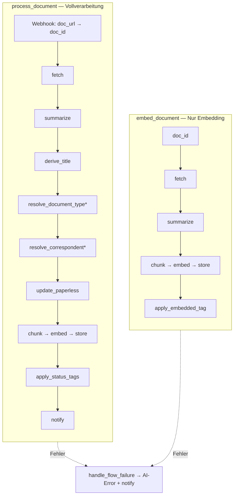

# Flows

Zwei Windmill-Flows decken die Haupt-Use-Cases ab. Beide nutzen Ollama (LLM + bge-m3) und speichern Vektoren in Qdrant.

## Übersicht



\* Schritt wird übersprungen, wenn der Wert bereits in Paperless gesetzt ist.

## `process_document`

**Trigger:** Paperless-Webhook bei **Document Added** (nach OCR und automatischem Matching).

**Zweck:** Metadaten per LLM generieren, Paperless aktualisieren, Chunks embedden und in Qdrant speichern.

| Schritt | Script | Beschreibung |
|---------|--------|--------------|
| Preprocessor | `preprocess_webhook` | Parst `doc_url` → `doc_id` |
| fetch | `fetch_document` | OCR-Text, Sprache, bestehende Tags/Typen/Korrespondenten |
| summarize | `summarize_document` | **LLM 1:** Summary + `document_date` aus Volltext |
| derive_title | `derive_title` | **LLM 2:** Titel aus Summary |
| resolve_document_type | `resolve_document_type` | **LLM 3:** Dokumenttyp (skip wenn gesetzt) |
| resolve_correspondent | `resolve_correspondent` | **LLM 4:** Korrespondent (skip wenn gesetzt) |
| update | `update_paperless` | PATCH Paperless; setzt `AI-Processed` |
| chunk | `chunk_document` | **LLM 5:** semantische Chunks + Summary-Chunk |
| embed | `generate_embeddings` | Vektoren via Ollama/bge-m3 |
| store | `store_qdrant` | Upsert in Qdrant |
| status_tag | `apply_status_tags` | `AI-Warning` bei Warnings |
| notify | `notify` | Status/Warnings loggen oder senden |

**Bei Fehlern:** `handle_flow_failure` setzt `AI-Error` und sendet Fehler-Benachrichtigung.

### LLM-Verhalten

- Summary + Datum aus **Volltext**; Fallback für Datum: Paperless-Hinzufügedatum
- Titel, Dokumenttyp, Korrespondent aus **Summary**
- Chunking aus **Volltext** + Summary-Chunk fürs Embedding
- Metadaten nur aus bestehenden Paperless-Listen (Typ/Korrespondent können neu angelegt werden)
- Inhalts-Tags: LLM prüft bestehende Tags, kann unpassende entfernen und passende ergänzen
- System-Tags (`AI-Warning`, `AI-Error`, `AI-Processed`, `AI-Embedded`) werden vom LLM ignoriert

### Manuell starten

```bash
wmill flow run f/paperless_chain/process_document \
  --base-url "$WMILL_BASE_URL" \
  --workspace "$WMILL_WORKSPACE" \
  --token "$WMILL_TOKEN" \
  -d '{"doc_id": 42}'
```

## `embed_document`

**Trigger:** Manuell, per Batch-Queue oder direkt per `doc_id`.

**Zweck:** Nur Embedding — **keine** Änderung an Titel, Tags, Korrespondent oder Dokumenttyp. Nutzt bestehende Paperless-Metadaten für Chunk-Kontext.

| Schritt | Script | Beschreibung |
|---------|--------|--------------|
| fetch | `fetch_document` | Text + bestehende Metadaten |
| summarize | `summarize_document` | Summary für Summary-Embedding |
| chunk | `chunk_document` | Semantische Chunks (Metadaten aus fetch) |
| embed | `generate_embeddings` | bge-m3 |
| store | `store_qdrant` | Upsert in Qdrant |
| embedded_tag | `apply_embedded_tag` | Setzt `AI-Embedded` |

**Bei Fehlern:** `handle_flow_failure` → `AI-Error`.

### Manuell starten

```bash
wmill flow run f/paperless_chain/embed_document \
  --base-url "$WMILL_BASE_URL" \
  --workspace "$WMILL_WORKSPACE" \
  --token "$WMILL_TOKEN" \
  -d '{"doc_id": 42}'
```

## Wann welcher Flow?

| Szenario | Flow |
|----------|------|
| Neues Dokument automatisch verarbeiten | `process_document` (Paperless-Webhook) |
| Bestehende Docs nachträglich mit AI-Metadaten | `process_document` (Batch-Queue) |
| Nur Qdrant aktualisieren, Metadaten unangetastet | `embed_document` |
| Re-Embedding nach Modellwechsel | `embed_document` (Batch-Queue) |

Batch-Details: [batch-processing.md](batch-processing.md)
